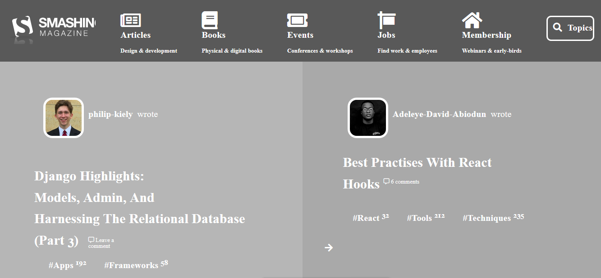

# Project Name

> One paragraph statement about the project.

Additional description about the project and its features.

## Built With

- HTML,
- CSS

## Live Demo

[Live Demo Link](https://rawcdn.githack.com/tGodson/Smah-Magazine-Heat-Map/4e4a79ab26dcbda8d38ab59a6700f7768a6f2be1/index.html)

## Authors

👤 **Author1**

- Github: [@tGodson](https://github.com/tGodson/)
- Twitter: [@tendongze95](https://twitter.com/tendongze95)
- Linkedin: [linkedin](https://www.linkedin.com/in/tendongze-godson-a95795163/)

👤 **Author2**

- Github: [@githubhandle](https://github.com/githubhandle)
- Twitter: [@twitterhandle](https://twitter.com/twitterhandle)
- Linkedin: [linkedin](https://linkedin.com/linkedinhandle)

## 🤝 Contributing

Contributions, issues and feature requests are welcome!

Feel free to check the [issues page](https://github.com/tGodson/Smah-Magazine-Heat-Map/issues).

## Show your support

Give a ⭐️ if you like this project!

## Acknowledgments

- Arafat

## 📝 License

This project is [MIT](lic.url) licensed.
